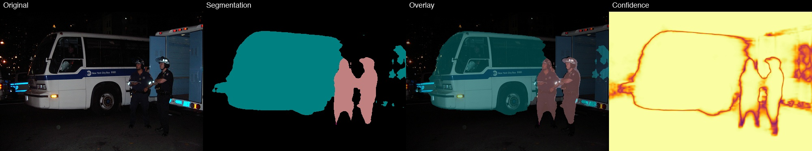
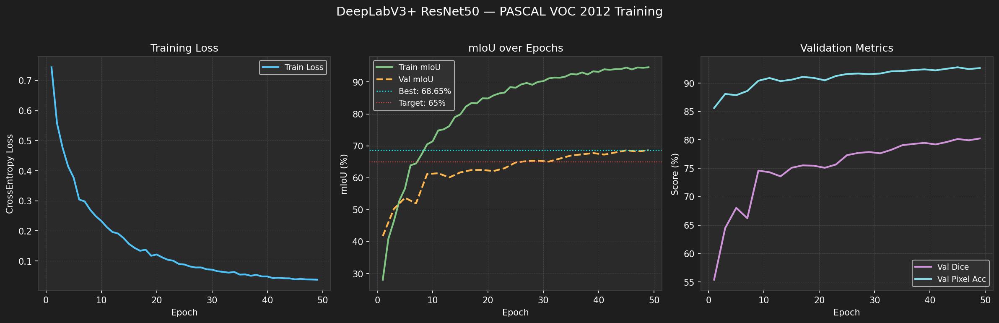
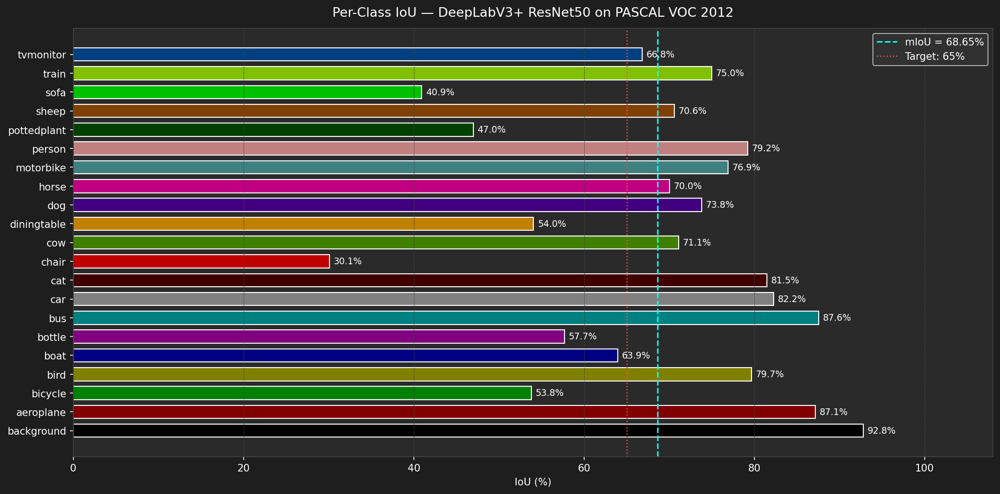

# Semantic Segmentation — Scene Understanding

> **DeepLabV3+ ResNet50 trained on PASCAL VOC 2012**  
> Pixel-wise classification of 20 object categories + background



---

## Results

| Model | Backbone | Val mIoU | Val Dice | Val Pixel Acc |
|---|---|---|---|---|
| DeepLabV3+ | ResNet50 | **68.65%** | 80.25% | 92.64% |

> Target: 65%+ mIoU ✅

### Training Curves


### Per-Class IoU


---

## Architecture
```
Input Image (3 × 512 × 512)
        │
   ResNet50 Encoder          ← ImageNet pretrained
   (pretrained on ImageNet)
        │
   ASPP Module               ← Multi-scale context (rates: 6, 12, 18)
   (Atrous Spatial Pyramid Pooling)
        │
   Decoder                   ← Fuses low-level + high-level features
        │
   Output (21 × 512 × 512)   ← Per-pixel class logits
        │
   argmax → Segmentation Mask
```

**Why DeepLabV3+:**
ASPP captures context at multiple scales simultaneously — critical for segmenting
objects that appear at vastly different sizes (a person 5m away vs 50m away).
The decoder fuses fine spatial detail from early encoder layers with rich semantic
context from deep layers, giving sharp object boundaries.

---

## Dataset

**PASCAL VOC 2012** — Semantic Segmentation track
- 1,464 training images / 1,449 validation images
- 20 object classes + background (21 total)
- Pixel-level annotations with boundary ignore index (255)

| Split | Images |
|---|---|
| Train | 1,464 |
| Val | 1,449 |

---

## Installation
```bash
git clone https://github.com/YOUR_USERNAME/semantic-segmentation
cd semantic-segmentation

conda create -n semseg python=3.10 -y
conda activate semseg

pip install torch torchvision
pip install segmentation-models-pytorch
pip install opencv-python albumentations
pip install pyyaml tqdm tensorboard matplotlib
```

---

## Usage

### Single Image Segmentation
```bash
python inference/segment.py \
  --image path/to/image.jpg \
  --checkpoint weights/best_model.pth
```

Outputs saved to `results/predictions/`:
- `*_grid.jpg` — Original | Segmentation | Overlay | Confidence heatmap
- `*_legend.jpg` — Overlay with color-coded class legend
- `*_mask.png` — Raw segmentation mask

### Video / Webcam Segmentation
```bash
# Video file
python inference/video_segmentation.py \
  --source path/to/video.mp4 \
  --output results/predictions/output.mp4

# Webcam
python inference/video_segmentation.py --source 0

# Every other frame (2x faster)
python inference/video_segmentation.py --source video.mp4 --every_n 2
```

### Training from Scratch
```bash
python training/train.py --config configs/config.yaml
```

### Resume Training
```bash
python training/train.py \
  --config configs/config.yaml \
  --resume weights/latest.pth
```

### Validate Checkpoint
```bash
python training/validate.py --checkpoint weights/best_model.pth
```

---

## Project Structure
```
semantic-segmentation/
├── data/
│   ├── dataset.py          # VOCSegmentationDataset + augmentations
│   ├── dataloader.py       # DataLoader factory
│   └── download_voc.py     # Dataset download utility
├── models/
│   ├── deeplabv3.py        # DeepLabV3+ wrapper
│   ├── unet.py             # U-Net wrapper
│   └── backbones.py        # Encoder registry
├── training/
│   ├── train.py            # Full training loop
│   ├── validate.py         # Validation pass
│   └── metrics.py          # IoU, Dice, Pixel Acc
├── inference/
│   ├── segment.py          # Single image inference
│   ├── video_segmentation.py  # Real-time video inference
│   └── visualization.py    # Colormap, overlay, legend, heatmap
├── configs/
│   └── config.yaml         # All hyperparameters
├── results/
│   ├── predictions/        # Per-image outputs
│   ├── metrics/            # per_class_iou.csv
│   └── visualizations/     # Charts and demo images
└── notebooks/              # Verification and analysis scripts
```

---

## Key Implementation Details

- **Loss:** `CrossEntropyLoss(ignore_index=255)` — boundary pixels excluded
- **Optimizer:** AdamW with weight decay 1e-4
- **Scheduler:** Polynomial LR decay — standard for segmentation
- **Augmentation:** RandomScale + PadIfNeeded + RandomCrop + HorizontalFlip + ColorJitter
- **Device:** Apple MPS (M1) — no CUDA required
- **Inference:** Logits resized before argmax for sharper boundaries

---

## Tech Stack


- **Framework:** PyTorch + torchvision
- **Models:** segmentation-models-pytorch
- **Augmentation:** Albumentations
- **Visualization:** OpenCV + Matplotlib
- **Experiment Tracking:** TensorBoard

---

## References

- [Encoder-Decoder with Atrous Separable Convolution (DeepLabV3+)](https://arxiv.org/abs/1802.02611)
- [The PASCAL Visual Object Classes Challenge](http://host.robots.ox.ac.uk/pascal/VOC/)
- [segmentation-models-pytorch](https://github.com/qubvel/segmentation_models.pytorch)